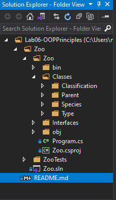

# Lab06- Inheritance & Lab07-Interfaces

### Description:
This program demonstrates how classes can inherit properties and methods from each other.

### Getting Started:
Clone the repository to your computer: `$ git clone https://github.com/Overholtk/Lab07-Interfaces.git`

Run the program in visual studio by selecting file - open - Project/Solution, then navigating to where you saved the file and selecting the .sln file.

### Visuals:

UML:

[UML Diagram PDF](./Assets/lab06-zoouml)

File Structure

### Changelog:
1/19/21: Published version 1.0
